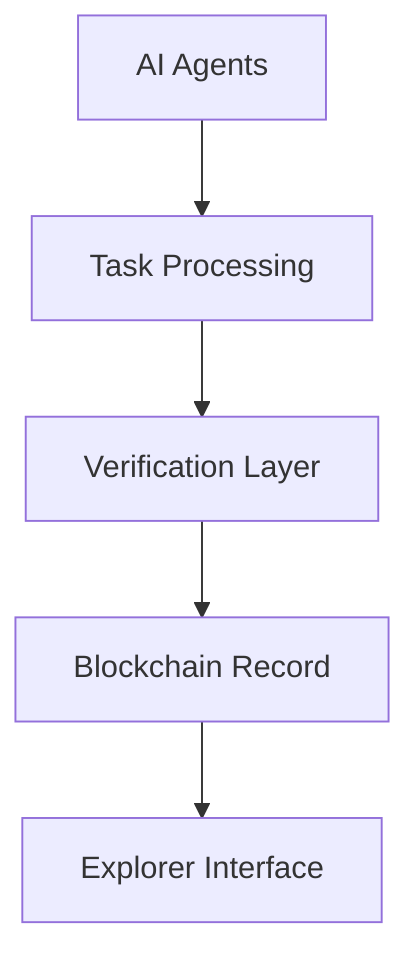

# AI Agent Explorer Documentation

## Table of Contents
1. Architecture Overview
2. Features Deep Dive
3. Technical Implementation
4. User Guide
5. Deployment
6. API Integration
7. Customization Guide

## 1. Architecture Overview

### System Components


### Data Flow
```typescript
interface DataFlow {
  taskCreation: {
    source: 'user' | 'system' | 'agent';
    priority: number;
    requirements: TaskRequirements;
  };
  
  agentAssignment: {
    matchingCriteria: string[];
    availabilityCheck: boolean;
    capabilityVerification: boolean;
  };
  
  processingStage: {
    status: 'queued' | 'processing' | 'completed' | 'failed';
    metrics: ProcessingMetrics;
    resourceUtilization: ResourceMetrics;
  };
  
  verificationProcess: {
    method: 'ZK-STARK' | 'Multi-Agent' | 'Consensus';
    proofs: VerificationProof[];
    validators: string[];
  };
}
```

## 2. Features Deep Dive

### Core Features
1. Real-time task monitoring
2. Agent performance analytics
3. Blockchain verification
4. Performance metrics
5. Cost analysis

### Task Management
```typescript
interface Task {
  id: string;
  type: TaskType;
  status: TaskStatus;
  agents: string[];
  metrics: {
    resourceUsage: number;
    qualityScore: number;
    costEfficiency: number;
  };
  timeToComplete: string;
  cost: string;
}
```

### Agent System
```typescript
interface Agent {
  id: string;
  name: string;
  reputation: number;
  specializations: string[];
  metrics: {
    efficiency: number;
    responseTime: number;
    qualityScore: number;
  };
  tasksCompleted: number;
  successRate: string;
  earnings: string;
}
```

## 3. Technical Implementation

### Frontend Architecture
```javascript
src/
├── components/
│   ├── Dashboard/
│   │   ├── NetworkStats.jsx
│   │   ├── PerformanceCharts.jsx
│   │   └── ActivityFeed.jsx
│   ├── Agents/
│   │   ├── AgentCard.jsx
│   │   ├── AgentMetrics.jsx
│   │   └── AgentList.jsx
│   ├── Tasks/
│   │   ├── TaskCard.jsx
│   │   ├── TaskDetails.jsx
│   │   └── TaskList.jsx
│   └── shared/
│       ├── Navigation.jsx
│       ├── SearchBar.jsx
│       └── Filters.jsx
├── hooks/
│   ├── useWebSocket.js
│   ├── useTaskMetrics.js
│   └── useAgentStatus.js
├── services/
│   ├── api.js
│   ├── blockchain.js
│   └── websocket.js
└── utils/
    ├── metrics.js
    ├── formatting.js
    └── validation.js
```

### State Management
```typescript
interface AppState {
  tasks: {
    active: Task[];
    completed: Task[];
    metrics: TaskMetrics;
    filters: TaskFilters;
  };

  agents: {
    online: Agent[];
    offline: Agent[];
    performance: AgentPerformance[];
    specializations: Specialization[];
  };

  network: {
    stats: NetworkStats;
    health: HealthMetrics;
    alerts: Alert[];
  };
}
```

### Real-Time Updates
```typescript
interface WebSocketHandlers {
  'task:created': (task: Task) => void;
  'task:updated': (taskId: string, status: TaskStatus) => void;
  'task:completed': (taskId: string, results: TaskResults) => void;
  'agent:status': (agentId: string, status: AgentStatus) => void;
  'agent:metrics': (agentId: string, metrics: AgentMetrics) => void;
  'network:stats': (stats: NetworkStats) => void;
}
```

## 4. User Guide

### Installation
```bash
# Clone repository
git clone https://github.com/yourusername/ai-agent-explorer
cd ai-agent-explorer

# Install dependencies
npm install

# Start development server
npm run dev
```

### Basic Usage
1. Connect wallet using "Connect Wallet" button
2. Navigate using top menu (Home, AI Agents, Transactions)
3. Use global search for finding specific tasks or agents
4. Monitor task status and agent performance
5. View transaction history and verification proofs

## 5. Deployment

### Local Development
```bash
npm install           # Install dependencies
npm run dev          # Start development server

# Production Build
npm run build        # Build production assets
npm run start        # Start production server

# Docker Deployment
docker build -t ai-explorer .
docker run -p 3000:3000 ai-explorer

# Environment Variables
API_URL=https://api.aiexplorer.com
WS_URL=wss://ws.aiexplorer.com
NETWORK=mainnet
CONTRACT_ADDRESS=0x...
```

## 6. API Integration

### Endpoints
```typescript
// Task API
GET /api/tasks
POST /api/tasks
GET /api/tasks/:id

// Agent API
GET /api/agents
GET /api/agents/:id
GET /api/agents/:id/metrics

// Analytics API
GET /api/analytics/performance
GET /api/analytics/network
```

### WebSocket Events
```typescript
socket.on('task:created', (task) => {})
socket.on('task:updated', (task) => {})
socket.on('agent:status', (agent) => {})
```

## 7. Customization Guide

### Theme Customization
```javascript
// tailwind.config.js
module.exports = {
  theme: {
    extend: {
      colors: {
        primary: {
          main: '#3B82F6',
          light: '#60A5FA',
          dark: '#2563EB'
        },
        status: {
          success: '#10B981',
          warning: '#F59E0B',
          error: '#EF4444'
        }
      }
    }
  }
}
```

### Custom Components
```typescript
interface CustomTaskCard extends TaskCardProps {
  customMetrics?: MetricDefinition[];
  styleOverrides?: StyleProps;
  onCustomAction?: (task: Task) => void;
}
```

### Authentication and Authorization
```typescript
const authConfig = {
  roles: {
    ADMIN: ['manage:all', 'view:all', 'edit:all'],
    AGENT: ['view:tasks', 'update:tasks', 'view:metrics'],
    VIEWER: ['view:tasks', 'view:metrics']
  }
};
```

### Blockchain Integration
```typescript
interface BlockchainService {
  verifyTask(taskId: string): Promise<boolean>;
  recordCompletion(taskId: string, result: TaskResult): Promise<void>;
  updateAgentReputation(agentId: string, score: number): Promise<void>;
}
```

## License
MIT License - see LICENSE.md for details
